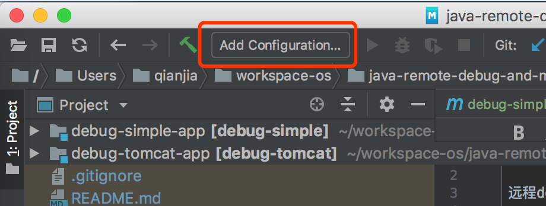
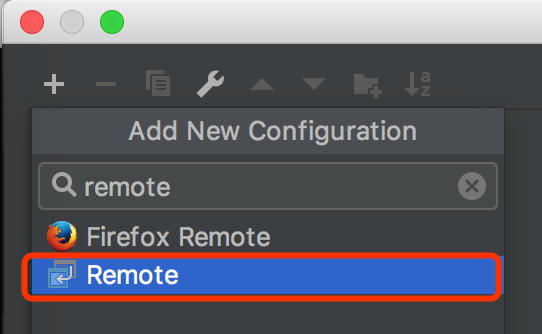
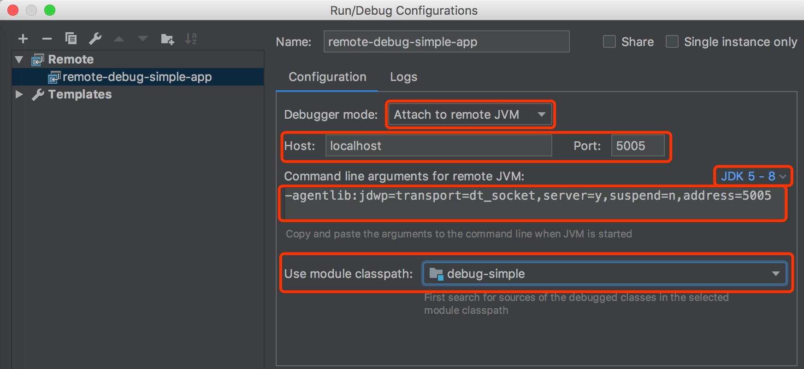
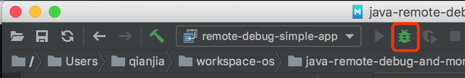

# 远程debug

远程debug的意思是启动一个Java进程，启动一个debugger进程，将两者连接起来，利用debugger来debug Java进程。

事实上目前所有的IDE的debug功能都是通过远程debug方式来实现，它们都利用了一个叫做JDPA（Java Platform Debugger Architecture）的技术。

利用JDPA我们除了能够在IDE开发的时候debug，也能够将IDE attach到一个生产环境上正在运行的Java进程做debug（事实上这两个场景在本质上是一样的）。

下面会用两个例子来说明如何使用Intellij IDEA来debug一个Java进程。

## debug一个简单的Java应用

我们做了一个很简单的Java应用，它启动后会每隔2秒打印出一个不断增长的数字。

源代码在`debug-simple-app`目录下：

1. 执行`mvn clean package`打包
2. 执行`java -jar target/debug-simple-app.jar`运行

现在我们要用IDEA远程Debug它。我们先`ctrl+c`把进程停止掉。

1. 把项目导入到IDEA里，因为如果没有源码的话我们没有办法打断点

1. 按照下面步骤新建一个Remote Run/Debug Configuration:
   1. 
   1. 选择Remote
      
      
   1. 除了改个名字，设定Use module classpath，其余的选项不需要修改，直接用默认的就行
      
      
      
      不过这里要解释一下各种参数：
      
      Debugger mode：debugger的模式，有两种：attach和listen。
      
      * attach的意思是debugger连接到被debug的Java进程，是主动式的。
      * listen的意思是debugger监听由Java进程发送过来的通信，是被动式的。
      
      Host和Port的设定了被debug的Java进程的Host和Port，实际上这也告诉我们，远程Debug是通过网络进行的。
      
      JDK选项可根据你的不同JDK版本来构造不同的Command line arguments for remote JVM。
      
      Command line arguments for remote JVM这个文本框你是不能修改的，它告诉了你如果要这个Java进程能够被远程Debug，那么必须添加这些参数才可以。
      所以你要把这里的参数复制出来，后面会用得着。

      Use module classpath，该选项设定使用那个module的源代码来debug。
   
1. 刚才的Command line arguments for remote JVM添加到刚才的运行命令。
   像这样：`java -agentlib:jdwp=transport=dt_socket,server=y,suspend=n,address=5005 -jar target/debug-simple.jar`

1. 点击下图里的Debug按钮开始debug
    
   
      
   你会发现Console里出现这么一句话`Connected to the target VM, address: 'localhost:5005', transport: 'socket'`，
   这说明debugger已经attach成功了。
     
1. 在debug-simple-app里的代码打个断点看看效果。


## debug一个tomcat应用

实际上debug一个tomcat应用和前面的例子没有什么大的区别。

我们写了一个很简单的Servlet，它会返回`Hello World`以及被访问的次数。

源代码在`debug-tomcat-app`目录下：

1. 执行`mvn clean package`打包
2. 把`target/debug-tomcat-app.war`丢到tomcat
3. 然后访问[http://localhost:8080/debug-tomcat-app/hello](http://localhost:8080/debug-tomcat-app/hello)查看结果

现在我们要用IDEA来debug，那么先把tomcat停掉。

1. 同样需要把项目导入到IDEA里
1. 执行tomcat的`bin/catalina.sh jpda start`，让tomcat可以被debug
1. 执行`jps -v | grep Bootstrap`找到Tomcat进程：
   
   ```txt
   76905 Bootstrap -Djava.util.logging.config.file=... 
   -Djava.util.logging.manager=org.apache.juli.ClassLoaderLogManager 
   -Djdk.tls.ephemeralDHKeySize=2048 
   -Djava.protocol.handler.pkgs=org.apache.catalina.webresources 
   -agentlib:jdwp=transport=dt_socket,address=localhost:8000,server=y,suspend=n 
   -Dcatalina.base=... 
   -Dcatalina.home=... 
   -Djava.io.tmpdir=...
   ```

   注意上面的`-agentlib...address=localhost:8000`参数，记住这个端口
1. 和前面的例子一样，新建一个Remote Run/Debug Configuration，把端口设定为8000，然后启动
1. 然后打个断点试试

如果你想改变Tomcat的端口怎么做？看看`bin/catalina.sh`你会发现这么一段注释

```txt
JPDA_TRANSPORT  (Optional) JPDA transport used when the "jpda start"
                command is executed. The default is "dt_socket".

JPDA_ADDRESS    (Optional) Java runtime options used when the "jpda start"
                command is executed. The default is localhost:8000.

JPDA_SUSPEND    (Optional) Java runtime options used when the "jpda start"
                command is executed. Specifies whether JVM should suspend
                execution immediately after startup. Default is "n".

JPDA_OPTS       (Optional) Java runtime options used when the "jpda start"
                command is executed. If used, JPDA_TRANSPORT, JPDA_ADDRESS,
                and JPDA_SUSPEND are ignored. Thus, all required jpda
                options MUST be specified. The default is:

                -agentlib:jdwp=transport=$JPDA_TRANSPORT,
                    address=$JPDA_ADDRESS,server=y,suspend=$JPDA_SUSPEND
```

所以你只需要提供`JPDA_ADDRESS`环境变量参数就行了。比如这样：`JPDA_ADDRESS=5005 bin/catalina.sh jpda start`

## 参考文档

* [Debug your Java code with ease using JPDA][blog]
* [JPDA Connection and Invocation][jpda-con-inv]
* [Oracle VM Invocation Options][jpda-inv-opt]

[blog]: https://www.techrepublic.com/article/debug-your-java-code-with-ease-using-jpda/
[jpda-con-inv]: https://docs.oracle.com/apps/search/search.jsp?q=jpda%20connection&category=java
[jpda-inv-opt]: https://docs.oracle.com/apps/search/search.jsp?q=agentlib:jdwp&category=java
